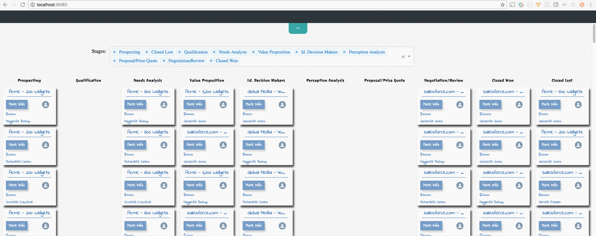
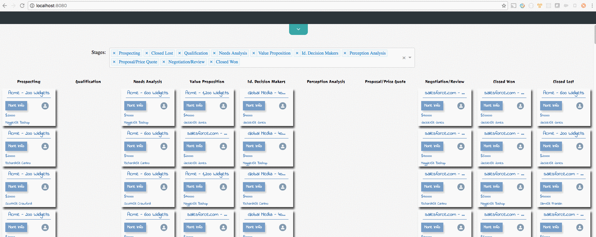

# toastr

* [snackbar tutorial](http://www.w3schools.com/howto/howto_js_snackbar.asp)

* How it works

  * in App component's render() function, we add Toastr compnent with a ref attribute so that we could refer it in other part of the code and call its method.

  ```
  App.jsx

  render(){

    ...

    case ActionTypes.UPDATED_OPP:
      this._toastr.success(this.props.state.appState.get('status'));

    ...

    return (
      ...
      <Toastr ref={(toastr) => {
          this._toastr = toastr;
      }}/>
      ...
    );
  }

  ```

  * in Toastr component's success() method, we used a hacky way to change its div element's class name

  ```
  Toastr.jsx

    success(){

      ...

      this._container.attributes['class'].ownerElement.className = 'toastr show';

      ...
    }


    render(){
      ...
      return (
          <div ref={(container) => {
              this._container = container;
          }} className="toastr show">
              {toastrList}
          </div>
      );
    }
  ```

  * every time success() function was called, Toastr component's render() function will also be automatically invoked afterwards; thus, success() was a good place to manipulate some data for Toastr component since render() would reflect the changes accordingly

* gist for success() method

  * we first change the container div's class name to `toastr show`, so the container div will be displayed with its fadein animation

  * we then register a timeout, so 4 seconds later, it will change the container div's class name back to `toastr`, so the Toastr component will disappear

* more about success() method

  * there are 2 scenarios for Toastr component to consider

    * if only 1 message was passed in - this was simple, Toastr just display the message, and wait for timeout callback to put everything back to normal

    

    * there are several consecutive messages passed in - we want to display those messages in a stack style, and want the timeout callback to be only called once (the only time timeout callback would be called should be 4 seconds later after the last message was passed in)

    

  * solution

    * we kept 2 arrays - messageList to contain all messages, and timeoutList to contain all registered timeout Ids

    * every time when success was called, we checked the timeoutList

      * if timeoutList is empty (this means the current success() method was being called when there was no registered timeout callback waiting to be called, which also means there were no messages currently being displayed either), then this is scenario 1 we talked above, and we would do:

      1. add message to messageList
      2. make Toastr component visible
      3. register a timeout callback, and put the id in timeoutList (if during the 4 seconds, there was no other messages coming in, then timeout callback would be called, which would first clear both timeoutList and messageList, and then set Toastr component to be invisible again)

      * if timeoutList is not empty (which means the current success() method was being called when there was already a registered timeout callback waiting to be called, which also means there were some messages currently being displayed too), then this is scenario 2 we talked above, and we would do:
      
      1. clear the current timeout
      2. add message to messageList
      3. make Toastr component invisible
      4. register another callback and put the id in timeoutList
